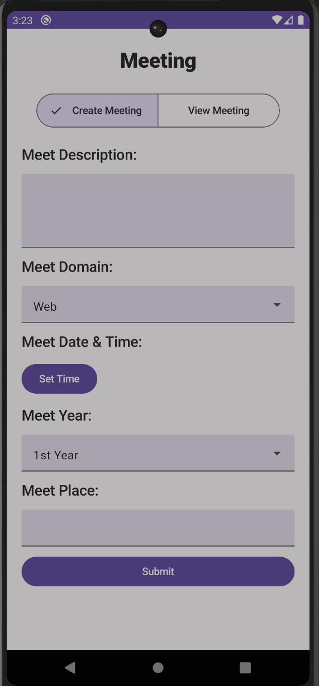

# Meeting Feature Module for Club App

Made a Compose Module to integrate Appwrites' CRUD operations within a Club Management App for Technocrats KIET.

## Screenshots

## Appwrite
Appwrite is an Open-source platform that lets you add Auth, DBs, Functions and Storage to your product and build any application at any scale, own your data, and use your preferred coding languages and tools. Get Started with Appwrite for Kotlin [`here`](https://appwrite.io/docs/quick-starts/android).
